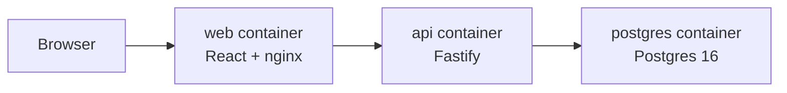

# Architecture

## Goals

Covey should be reliable enough for daily farm records, simple enough to self-host, and structured enough to grow into multi-user flock management without a rewrite.

## Components

- `apps/web`: React frontend built by Vite and served by nginx.
- `apps/api`: Fastify API with TypeScript.
- `packages/db`: SQL migrations and database documentation.
- `postgres`: durable Postgres storage managed by Docker Compose.

## Domain Model

The initial database schema supports:

- Homesteads and homestead-level settings
- Users, roles, and sessions
- Coops with coop types such as breeding, grow-out, brooder, hospital, and other
- Birds with status tracking for active, processed, sold, died, retired, and culled
- Case-insensitive active band uniqueness per homestead
- Breeding lines
- Pen mating periods with sire and hen group membership over time
- Incubations with fertility and hatch metrics
- Hatch batches
- Feed catalog and coop feed logs using cup, pound, or ounce units
- Egg logs
- Weight history
- Audit events

## Recommended Feature Migration Order

1. Authentication and homestead settings
2. Coops and flock list
3. Bird profile, weight history, and lifetime cost
4. Feed catalog and feed logs
5. Egg logs
6. Breeding lines, mating periods, incubation, and hatch batches
7. Recommendations and To Do
8. Reports, ROI, and value ratings

This order keeps the app useful early while also moving the highest-dependency pieces first.

## Security Posture

The API starts with:

- Argon2id password hashing
- HTTP-only session cookies
- SameSite cookie protection
- Security response headers
- Rate limiting
- Strict CORS configuration
- Database-level uniqueness and integrity constraints

Future production work should add:

- Email verification
- Password reset tokens
- Optional multi-factor authentication
- Role-based authorization checks on every data route
- Full audit trails for mutations
- Automated backup and restore testing

## Deployment Shape

The first deployment target is Docker Compose:

For internet-facing hosting, place a TLS reverse proxy in front of the web service.
